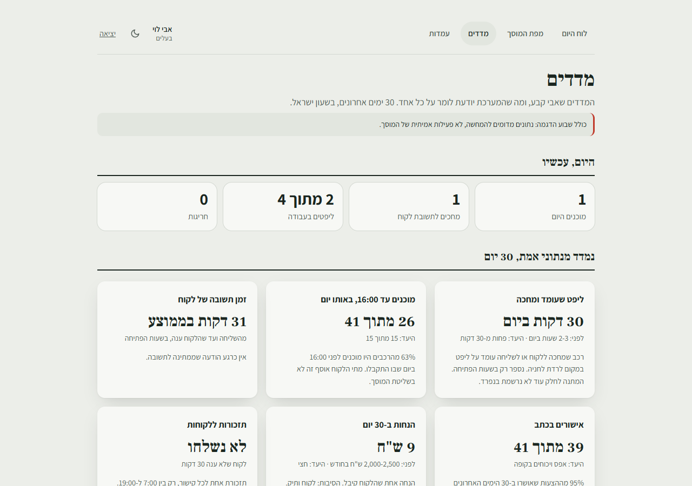

# מדריך לבעלים: מה אבי צריך לדעת

> **למי:** אבי לוי.
> **הקצר:** אתה לא צריך לעבוד עם המערכת כל יום. דניאל מפעיל אותה. אתה צריך לדעת איפה רואים את המספרים, מתי נדרש אתה, ומה עושים כשמשהו לא עובד.

## מה השתנה אצלך

| לפני | עכשיו |
|---|---|
| 25-35 שיחות "מתי מוכן" ביום | הלקוח מקבל הודעה בוואטסאפ כשהרכב מוכן, ויכול לשאול את הבוט "מה המצב של הרכב שלי?" |
| שעתיים כל ערב על הטלפון, לקבוע תורים | הלקוחות קובעים תור לבד באתר, 24 שעות ביממה. אישור ותזכורת יוצאים לבד |
| ליפט עומד שעתיים-שלוש ביום, מחכה לתשובה | הלקוח מקבל קישור עם תמונה ועונה מהר יותר, ורכב סגור שמחכה יורד לחניה. תזכורת אחרי חצי שעה, ודניאל מתקשר אחרי שעה |
| 2,000-2,500 ₪ בחודש בהנחות התנצלות | כל הנחה נרשמת: כמה, למה ומי. דניאל עד 10%, מעל זה רק אתה |
| "הכול בראש שלי" | השוליה שואל את "המוסכניק הוותיק" בעמדה, בעברית, בערבית וברוסית |

## 1. המדדים: פעם בשבוע, חמש דקות

**`levi-garage.co.il/staff/dashboard`**

- **למעלה, "היום, עכשיו":** ארבעה מספרים לעשר שניות. כמה רכבים מוכנים היום, כמה מחכים לתשובת לקוח, כמה ליפטים בעבודה, וכמה חריגות. אם יש חריגות, לחיצה מובילה אליהן בלוח היום.
- **ליפט שעומד ומחכה:** המספר הכי חשוב. כמה דקות ביום רכב עמד על ליפט בזמן שחיכה ללקוח או לדניאל, רק בשעות הפתיחה. היה 2-3 שעות ביום, והיעד פחות מ־30 דקות.
- **מוכנים עד 16:00, באותו יום:** היעד שלך, 15 מתוך 15. נמדד מהרגע שדניאל לוחץ "הרכב מוכן", ולא מתי הלקוח בא לאסוף.
- **אישורים בכתב:** כמה מההצעות אושרו בקישור או בחתימה. כל אחד מהם הוא ויכוח בקופה שלא יקרה.
- **הנחות ב־30 יום:** מול 2,000-2,500 ₪ בחודש שהלכו קודם. רק מה שנרשם במערכת, עם הסיבה.
- **"עדיין לא נמדד, וזו הסיבה":** המערכת אומרת בכנות מה היא לא יודעת, במקום להמציא מספר.

## 2. מתי צריכים אותך

- **הנחה מעל 10%.** דניאל לא יכול לתת לבד, אבל הוא מבקש ממך מתוך המערכת. בסרגל העליון, בכל מסך, מופיע **"הנחה לאישור 1"**, ובלוח היום יש קבוצה **"דניאל מבקש הנחה: לאשר?"**: הרכב, הממצא, המחיר לפני ואחרי, והסיבה של דניאל. **"לאשר 20%"** או **"לא"**. עד שתענה, הממצא לא יוצא ללקוח. אפשר גם לתת לבד, עד 30%, מכרטיס העבודה.
- **דניאל לא נמצא.** אתה יכול לעשות כל מה שהוא עושה. [המדריך שלו](daniel.md).
- **פעולה מסוכנת:** כשמכונאי שואל את "המוסכניק הוותיק" על משהו מסוכן (חשמל, כריות אוויר, בלמים), הוא עוצר ואומר לו לקרוא לך.

## 3. מי רואה מה

| מי | רואה | לא רואה |
|---|---|---|
| **אתה ודניאל** | הכול | — |
| **מכונאי** | הליפט שלו, התור, מפת המוסך, הכרטיס | מחירים לא מאושרים, הנחות, קודים של אחרים |
| **מסך הסדנה** | לוחיות, דגם, שעון | שמות, טלפונים, מחירים |
| **מסך חדר ההמתנה** | שלוש הספרות האחרונות של הלוחית, "בעבודה" או "מוכן" | כל השאר |

## 4. כשמשהו לא עובד

1. **קודם:** [שאלות נפוצות ופתרון תקלות](faq.md).
2. **המערכת לא זמינה בכלל?** עובדים כמו פעם: טלפון, ודף והדפסה. **מה שכבר נשמר במערכת נשאר.** על כל רכב רושמים בדף מה אושר ומה בוצע, וכשהמערכת חוזרת, דניאל מעדכן ממנו את הלוח לפני שממשיכים.
3. **ואז רועי.** מצלמים את המסך, ובתחתית שלו לוחצים "נתקלתם בתקלה? צלמו את המסך ושלחו לנו". נפתח מייל למוסך, ובנושא שלו כבר כתובים הגרסה והמסך. מצרפים את הצילום, ורועי מטפל ועונה. בשלושת החודשים הראשונים התמיכה כלולה. תקלה דחופה (מכונאים לא נכנסים, קישור לא יוצא) מטופלת תוך שעתיים. [איך בדיוק](faq.md#כללי).

## 5. מה נשאר לשלב הבא

אם תרצה בהמשך: הזמנת חלקים מספקים, תזכורות טיפול ללקוחות קיימים, ומעבר לוואטסאפ העסקי הרשמי. כל אלה בהצעת מחיר נפרדת. הפירוט ב[הסכם](../service-agreement.md).
