# מדריך למנהל העבודה: מהדלפק ועד המסירה

> **למי:** דניאל (מנהל מקצועי ושגריר ה-AI), ואבי כשהוא מחליף אותו.
> **איפה:** המחשב בדלפק, והנייד. כתובת: `levi-garage.co.il/staff`

## למה זה טוב לך

- **הטלפון מפסיק לצלצל על "מתי מוכן".** הלקוח מקבל הודעה בוואטסאפ כשהרכב מוכן, ויכול לשאול את הבוט מה המצב.
- **לא רודפים אחרי לקוחות.** הקישור לאישור יוצא לבד. אחרי 30 דקות בלי תשובה הלקוח מקבל תזכורת, ואחרי שעה אתה רואה "להתקשר".
- **הליפטים לא עומדים.** רכב סגור שמחכה לתשובה יורד לחניה, והמכונאים מושכים את הבא בתור לבד.
- **אין ויכוחים בקופה.** כל אישור נשמר בכתב, עם השעה ועם מה שהלקוח בחר. גם ההצעה הראשונה, מהקבלה, מאושרת על ידי הלקוח עצמו.

---

## 1. הבוקר: לוח היום

**לוח היום** מסודר לפי מה שדוחף: קודם **חריגות** (רכב שעבר את הזמן שלו: 30 דקות בתור לליפט, 4 שעות על ליפט, שעתיים מוכן ולא נאסף), אחר כך מי שקורא לך, לקוחות שאישרו ורכב שלהם מחכה בחניה ("להחזיר לתור"), לקוחות שלא ענו שעה ("להתקשר"), ממצאים שמחכים לתמחור (שורה לכל רכב), ובסוף התורים של היום.

**הלוח מתעדכן לבד**, תוך שנייה מכל שינוי. לא צריך לרענן.

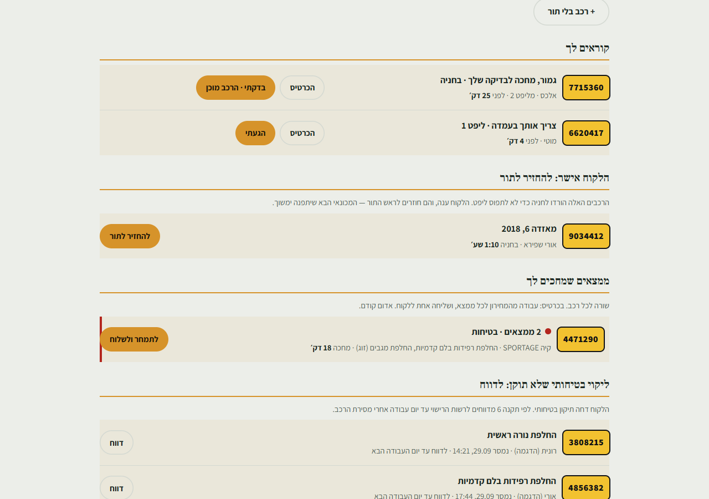

למטה, **"תורים להיום"**: מי עוד אמור להגיע, וכפתור "קבלת רכב" לכל אחד.

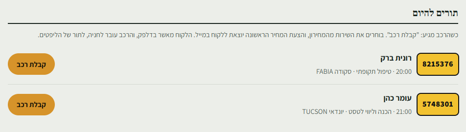

## 2. קבלת רכב בדלפק

על התור: **"קבלת רכב"** (או **"הגיע מוקדם"** לתור של יום אחר).

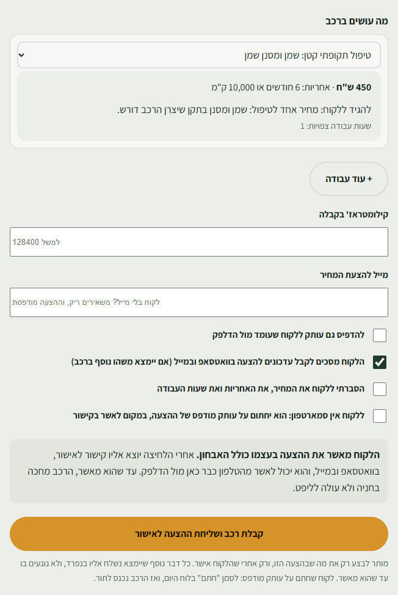

1. **מה עושים ברכב:** כבר מולא מההזמנה. אפשר לשנות, ו**"+ עוד עבודה"** מוסיף עבודה נוספת לאותה הצעה (למשל טסט וגם טיפול).
2. **איזה חלק:** מקורי או חלופי. **תגיד ללקוח בקול את ההבדל**, זה כתוב לך על המסך. החוק מחייב (סעיף 131).
3. **ק"מ ומייל.** אין ללקוח מייל? משאירים ריק, וההצעה מודפסת. הלקוח עומד מולך ורוצה דף? **"להדפיס גם עותק"**.
4. **הסכמה לעדכונים** בוואטסאפ ובמייל, ו**"הסברתי"**.
5. **"קבלת רכב ושליחת ההצעה לאישור":** **הלקוח מאשר את ההצעה בעצמו**, בקישור שיוצא אליו בוואטסאפ ובמייל. הוא יכול לאשר מהטלפון כבר מולך, בדלפק. **אתה חוזר ללוח**, ללקוח הבא.

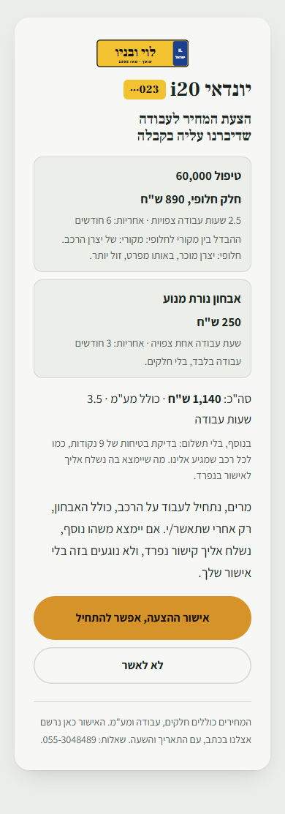

**עד שהלקוח מאשר, הרכב מחכה בחניה ולא עולה לליפט.** הליפט לא מחכה לו: התור מדלג עליו. בלוח הוא מופיע תחת **"מחכים לאישור הלקוח על הצעת הקבלה"**:

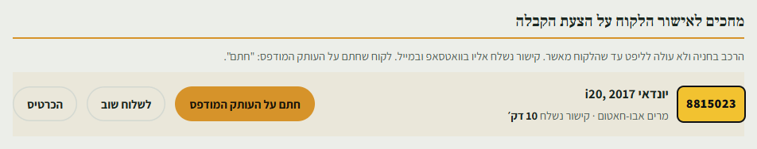

- **"לשלוח שוב":** הלקוח אומר שלא קיבל. אותו קישור יוצא שוב (בוואטסאפ, פעם בעשר דקות לכל היותר).
- **לקוח בלי סמארטפון:** בטופס הקבלה מסמנים **"ללקוח אין סמארטפון"**. ההצעה מודפסת, הלקוח חותם על העותק, ואתה לוחץ **"חתם על העותק המודפס"**. מאותו רגע הרכב נכנס לתור.
- **הלקוח לחץ "לא מאשר":** השורה הופכת לאדומה, **"להתקשר אליו"**, עם הטלפון שלו. לא נוגעים ברכב עד שמדברים.

גם בכרטיס של הרכב כתוב שהוא מחכה לאישור, עם אותם כפתורים, ואחרי האישור: איך אושר ומתי.

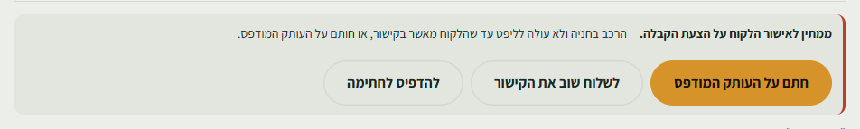

> **למה הלקוח מאשר בעצמו:** ככה האבחון והטיפול שהוזמן מאושרים בכתב, מהטלפון שלו, לפני שהרכב זז. כל מה שיימצא אחר כך נשלח אליו לאישור בנפרד. בלי אישור לא מתחילים שום עבודה (תקנה 8). האישור נשמר עם התאריך והשעה.

**רכב שהגיע בלי תור:** בלוח היום, **"+ רכב בלי תור"**. ממלאים מספר רישוי וטלפון (ושם, מייל ושירות אם יש), והמערכת שולפת את פרטי הרכב ממשרד התחבורה. משם זו אותה קבלה בדיוק.

**ה-QR בקבלה:** לקוח שלא הסכים לעדכונים בוואטסאפ (או שהגיע בלי תור) רואה אצלך קוד QR. הוא סורק אותו בטלפון שלו ושולח הודעה שכבר כתובה. **ההודעה שלו היא ההסכמה.** כשהיא מגיעה, הקוד נעלם לבד והתיבה "הלקוח מסכים" מסתמנת. בלי סמארטפון: מסמנים שיחתום על עותק מודפס. ללקוח שהגיע בלי תור, דף ההצעה מבקש גם אישור של התקנון ומדיניות הפרטיות.

**לקוח כתב "הסר" בוואטסאפ:** מאותו רגע הוא לא מקבל מאיתנו הודעות בוואטסאפ, וההצעות יוצאות אליו רק במייל (אם השאיר). הוא יכול לחזור בכל רגע, בהודעה "אשמח לקבל עדכונים".

## 3. מפת המוסך: מי איפה

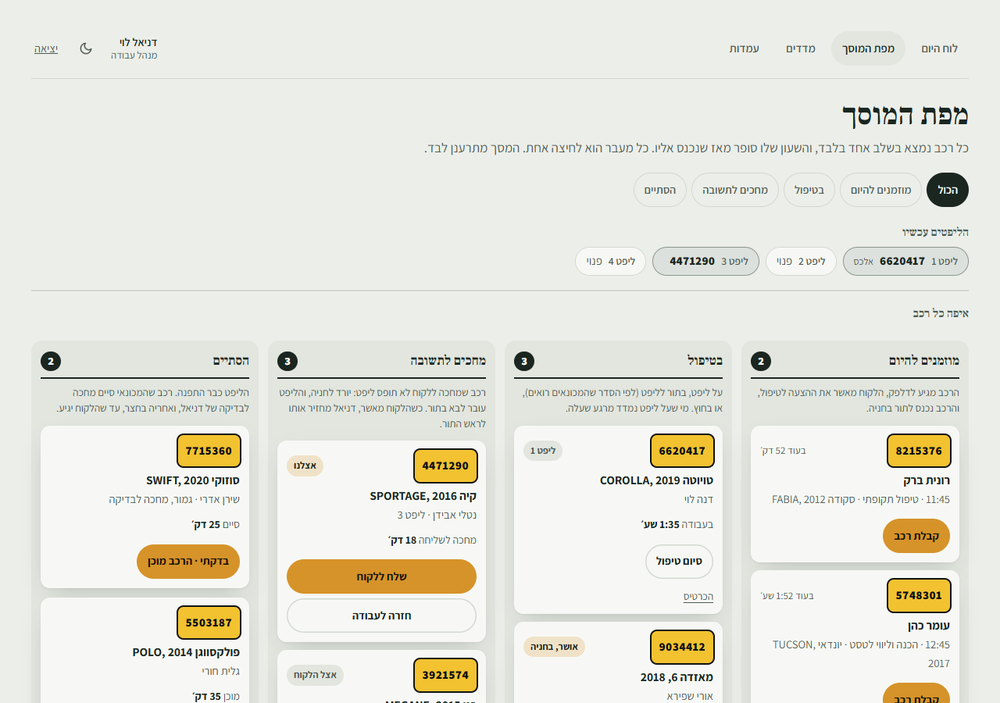

- **למעלה, "הליפטים עכשיו":** ארבעת הליפטים, ומי שמשך את הרכב לכל אחד.
- **"בטיפול":** רכבים על ליפט, ורכבים **בתור** (עם המספר שלהם בתור).
- **"לראש התור":** מקדים רכב. המכונאי הבא שיתפנה ימשוך אותו.
- **"לעבוד בחוץ":** עבודה קטנה שלא צריכה ליפט.
- **"העלה":** להעלות רכב לליפט פנוי בעצמך.

## 4. ממצאים: לתמחר ולשלוח

מכונאי צילם ודיבר, או בחר מהמחירון. בלוח: **"ממצאים שמחכים לך"**, **שורה אחת לכל רכב**, אדום קודם.

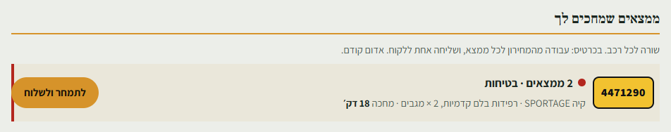

**"לתמחר ולשלוח":**

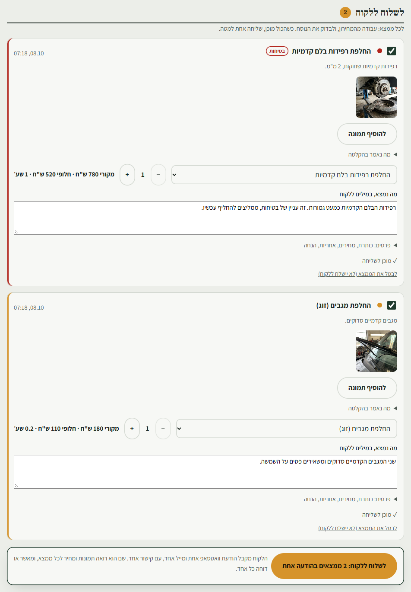

בכרטיס, **"לשלוח ללקוח"**: כל ממצא הוא שורה קצרה, עם התמונות ומה שנאמר בהקלטה.

0. **הלקוח ביקש עוד משהו, או שמכונאי אמר לך בעל פה?** בכרטיס: **"+ ממצא: עבודה מהמחירון"**. בוחרים עבודה, והיא נכנסת ל"לשלוח ללקוח" עם המחיר מהמחירון, כמו ממצא מהעמדה.
1. **עבודה מהמחירון:** בוחרים, והמחיר, השעות, האחריות וההבדל בין החלקים מתמלאים **ונשמרים** לבד. ממצא שהמכונאי בחר בעמדה מהמחירון מגיע כבר מתומחר. ממצא מצילום ודיווח, או פריט אדום מהבדיקה, מגיע בלי מחיר: בוחרים לו עבודה מהמחירון. **כמות** (למשל 2 צמיגים): בכפתורי − ו-+, והמחיר מוכפל.
2. **הנוסח ללקוח** נכתב מההקלטה של המכונאי, **בלי מחירים**. אפשר לתקן. כל השאר (כותרת, מחירים, אחריות, הנחה) תחת **"פרטים"**.
3. **הנחה:** עד 10%, עם סיבה. הסיבה נרשמת ונשארת פנימית, והלקוח רואה רק את האחוז ואת המחיר. כשיש הנחה, ליד שדות המחיר כתוב "(מחירון, לפני הנחה)", ומתחת לכל שדה מופיע המחיר שהלקוח יראה.
   **מעל 10%: "צריך יותר מ-10%? לבקש מאבי".** בוחרים אחוז (15-30) וכותבים סיבה. אבי רואה את הבקשה בלוח שלו ומאשר או דוחה. עד שהוא עונה, הממצא מסומן "⏳ מחכה לאבי" ולא נשלח ללקוח. כשהוא מאשר, ההנחה נכנסת לממצא לבד. הלקוח הסתפק בפחות? **"לבטל את הבקשה"**.
4. ממצא שמוכן מסומן **"✓ מוכן לשליחה"**. משהו שלא שולחים: **"לבטל את הממצא (לא יישלח ללקוח)"**. הוא מתבטל, ולא רק יוצא מההודעה.
5. **כפתור אחד למטה: "לשלוח ללקוח: X ממצאים בהודעה אחת"**, והמספר לפי כמה ממצאים מוכנים. הלקוח מקבל **הודעת וואטסאפ אחת ומייל אחד**, עם קישור אחד. שם הוא רואה תמונה, מחיר ואחריות לכל ממצא, ומאשר או דוחה כל אחד.

> **אם המערכת מסרבת לשלוח**, היא אומרת למה. בדרך כלל חסרים שעות, אחריות, חלק חלופי, או הסבר למה אין חלופה. החוק דורש את כולם.

> **שום דבר לא יוצא ללקוח מהעמדה.** גם ממצא מהמחירון עובר דרכך, כדי שהלקוח יקבל הודעה אחת ולא חמש.

> **"הקלטה לא תואמת לפריט":** אם המכונאי דיבר על משהו אחר מהפריט שבאבחון (למשל מגבים תחת "צמיגים"), מופיעה אזהרה בכתום. לבדוק לפני ששולחים.

## 5. הלקוח ענה: להחזיר לתור

רכב שהמכונאי הוריד לחניה והלקוח אישר מופיע בלוח. **"להחזיר לתור"**, והוא נכנס לראש התור.

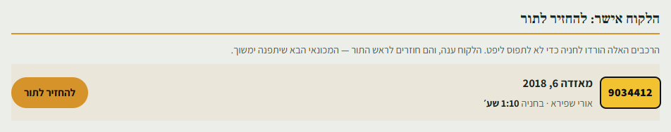

## 6. קוראים לך

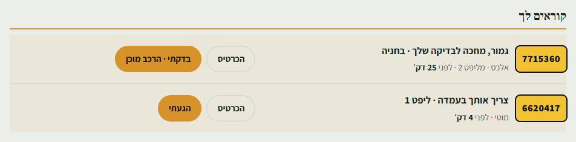

- **"צריך אותך בעמדה":** המכונאי לחץ "דניאל, בוא לעמדה". כשהגעת: **"הגעתי"**, או על המסך שלו **"דניאל כאן?"** והקוד שלך.
- **"גמור, מחכה לבדיקה שלך · בחניה":** המכונאי לחץ "סיימתי", **והליפט כבר התפנה**. בודקים את הרכב בחניה, ו**"בדקתי · הרכב מוכן"**: הלקוח מקבל הודעה בוואטסאפ.

## 7. הרכב מוכן, ונמסר

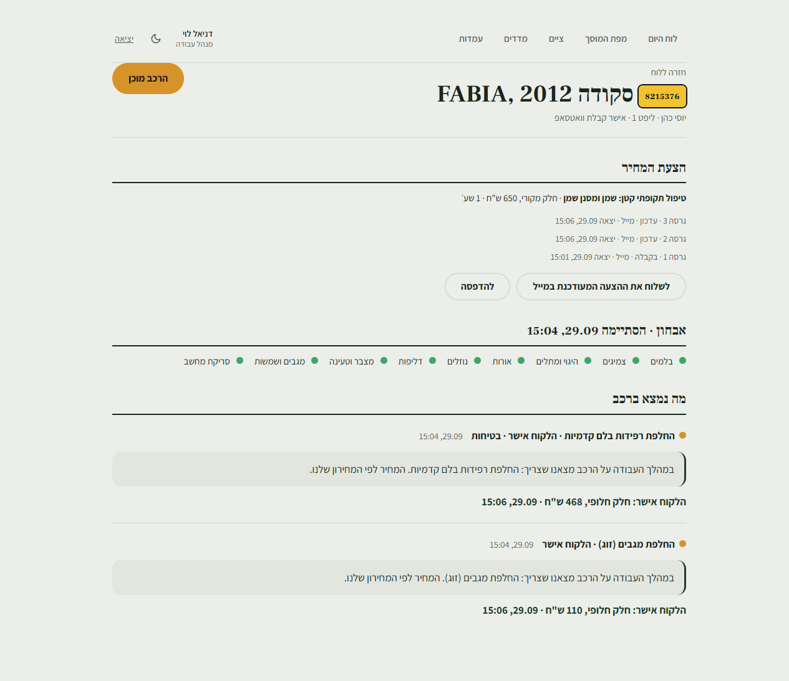

- **"הרכב מוכן":** מופיע רק אחרי האבחון, וכשאין ממצאים שמחכים. הלקוח מקבל הודעה בוואטסאפ, עם מתי אפשר לבוא לאסוף לפי שעות הפתיחה.
- כשהלקוח מגיע: **מפת המוסך** ← "הסתיים" ← **"נמסר ללקוח"**.

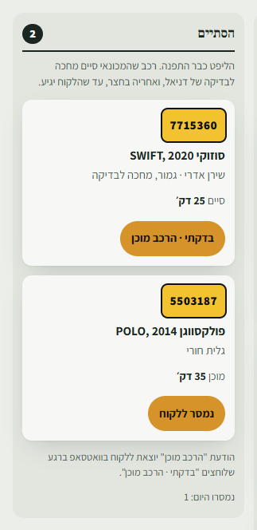

## 8. עמדות וקודים

**מכשיר חדש ליד ליפט (פעם אחת):** במכשיר עצמו פותחים את מסך העמדה ולוחצים **"לבקש מדניאל לחבר"**. על המסך שלו מופיע מספר, ואצלך, בלוח היום ובמסך "עמדות", מופיע **"מכשיר 4136 מבקש להיות עמדה"**:

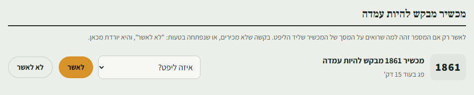

- **המספר זהה למה שעל המכשיר?** בוחרים ליפט ו**"לאשר"**. המכשיר מתחבר לבד.
- **בקשה שלא מכירים, או שנפתחה בטעות:** **"לא לאשר"**. היא יורדת מהלוח מיד.
- **אתה עומד ליד המכשיר?** אפשר לאשר עליו: **"דניאל כאן? לאשר עם הקוד שלו"**, ליפט, השם שלך והקוד. בלי לחזור לדלפק.

**דרך נוספת, בקוד QR:** **עמדות** ← **"לחבר טלפון או טאבלט לעמדה"**: בוחרים ליפט, **"ליצור קוד"**, וסורקים בטלפון שליד הליפט.

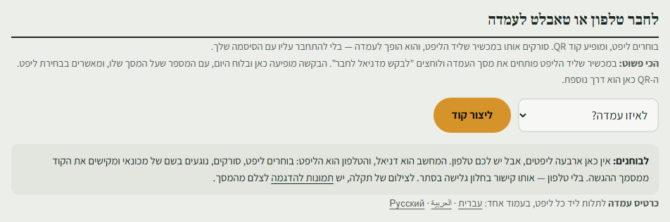

- **קוד למכונאי חדש, או מכונאי שננעל:** באותו דף, "קודים של הצוות".
- **גם לך יש קוד**, באותה רשימה. כשמכונאי קרא לך ואתה כבר ליד הליפט, לא צריך לחזור לדלפק: על המסך שלו, **"דניאל כאן?"**, ואז הקוד שלך. המכונאי לא יכול לסגור את הקריאה בלעדיך.
- **מכשיר אבד או נגנב:** "עמדות פעילות" ← **"ביטול"**. הוא מפסיק לעבוד מיד.
- **כרטיס עמדה להדפסה:** באותו דף, "כרטיס עמדה": עברית, العربية או Русский ← **"להדפסה"**. עמוד A4 אחד, תולים ליד כל ליפט בשפה של מי שעובד עליו. [איך הוא נראה](station-card.md).

## 9. ליקוי בטיחותי שהלקוח דחה

אם לקוח דחה תיקון שסומן כבטיחותי, הוא מופיע בלוח תחת **"ליקוי בטיחותי שלא תוקן: לדווח"**. מדווחים לרשות הרישוי עד יום העבודה שאחרי המסירה (תקנה 6), ולוחצים **"דווח"**.

---

**כשמשהו לא עובד:** [שאלות נפוצות ופתרון תקלות](faq.md). ואם לא שם: מצלמים את המסך ולוחצים בתחתית שלו על "נתקלתם בתקלה? צלמו את המסך ושלחו לנו". נפתח מייל עם הגרסה והמסך, מצרפים את הצילום ורועי עונה. [איך בדיוק](faq.md#כללי).
