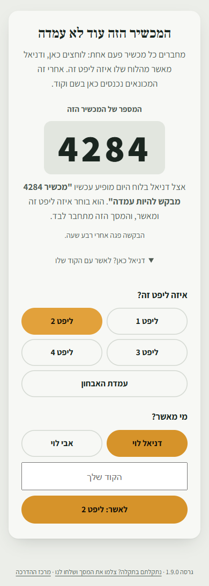
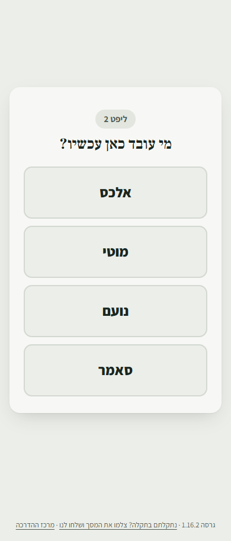
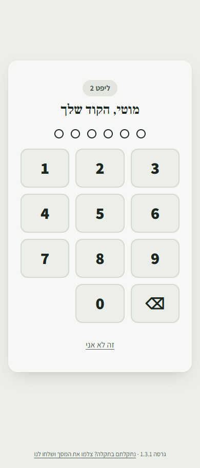
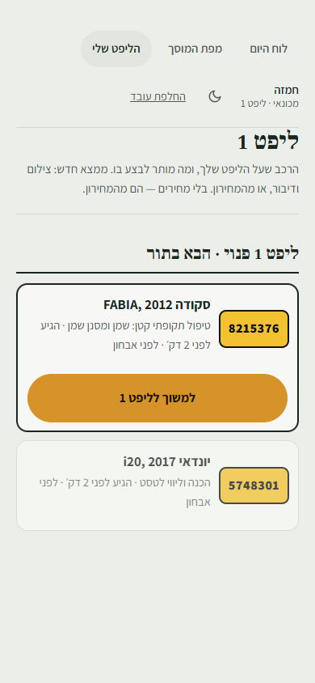
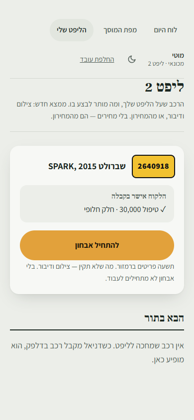
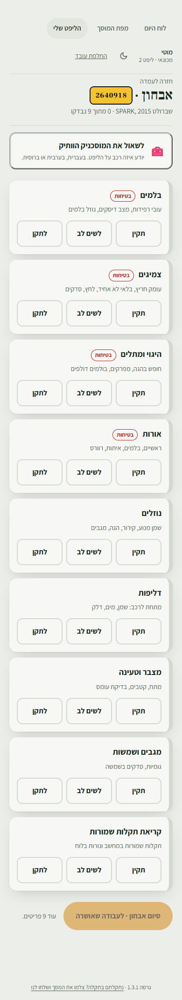
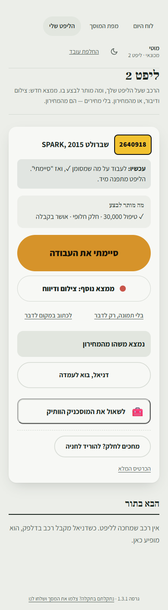
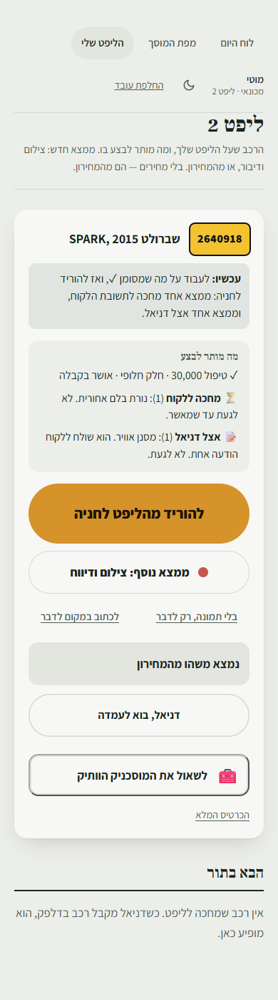
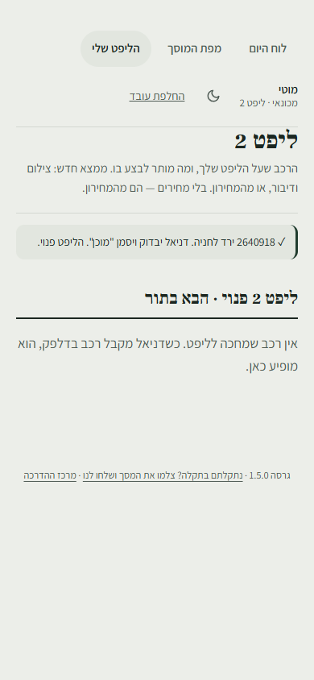
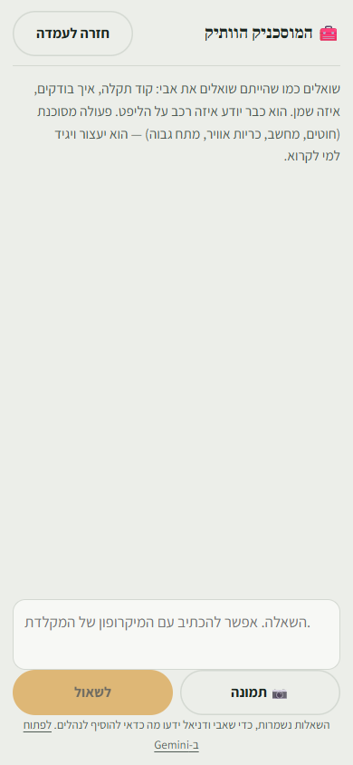

# מדריך למכונאי: העמדה שליד הליפט

> **למי:** מוטי, סאמר, אלכס, נועם, וכל מכונאי חדש.
> **כמה זמן לקרוא:** 5 דקות. **כמה זמן ללמוד:** רכב אחד.

## למה זה טוב לך

- **לא מחכים ליד רכב בלי אישור.** אם הלקוח עוד לא ענה ואפשר לנסוע ברכב, הוא יורד לחניה ולוקחים את הבא. רכב פתוח, מפורק או בלי שמן לא זז מהליפט.
- **לא מקלידים ולא מתמחרים.** מצלמים, אומרים מה ראית, ודניאל עושה את השאר.
- **תמיד ברור מה מותר לעשות ברכב.** מה שמסומן ✓ מותר. כל השאר לא.
- **כפתור אחד גדול אומר מה עכשיו.** לא צריך לנחש מה הצעד הבא.

---

## 0. מכשיר חדש ליד הליפט (פעם אחת)

טלפון או טאבלט שעוד לא מחובר לליפט מראה **"המכשיר הזה עוד לא עמדה"**.

1. לוחצים **"לבקש מדניאל לחבר"**. על המסך מופיע מספר גדול, למשל 4136.
2. אצל דניאל בלוח מופיע **"מכשיר 4136 מבקש להיות עמדה"**. הוא בוחר איזה ליפט זה ומאשר, והמכשיר מתחבר לבד.
3. **דניאל עומד לידך?** **"דניאל כאן? לאשר עם הקוד שלו"**: הוא בוחר ליפט, נוגע בשם שלו ומקיש את הקוד שלו, על המכשיר עצמו.

> זה קורה פעם אחת לכל מכשיר. אחרי זה הוא נשאר עמדה של אותו ליפט.

## 1. להיכנס

ליד כל ליפט יש טלפון או טאבלט על מתקן. הוא שייך לליפט, לא לך.

1. נוגעים **בשם שלך**.
2. מקישים **את הקוד שלך**, 6 ספרות. אין כפתור "אישור": בספרה השישית נכנסים לבד.

| | |
|---|---|
|  |  |

> **שכחת את הקוד, או שהוא ננעל** (אחרי 5 טעויות, ל-15 דקות)? דניאל קובע לך קוד חדש.

## 2. למשוך את הבא בתור

כשהליפט פנוי, רואים את **הבא בתור**. לוחצים **"למשוך לליפט"**.

- הסדר נקבע לפי מי שהגיע קודם. אם דניאל הקדים רכב, הוא יהיה ראשון.
- **רכב שהלקוח עוד לא אישר את הצעת הקבלה לא מופיע בתור.** הוא מחכה בחניה, ונכנס לתור ברגע שהלקוח מאשר. ככה הליפט לא מחכה לו.

## 3. אבחון, לפני כל עבודה

רכב חדש על הליפט: הכפתור היחיד הוא **"להתחיל אבחון"**. למעלה כתוב מה הלקוח כבר אישר בקבלה.

לכל אחד מ-9 הפריטים בוחרים צבע:
- **תקין (ירוק):** נגיעה אחת, וממשיכים.
- **לשים לב (צהוב) או לתקן (אדום):** **"לצלם ולהגיד מה ראית"**. המצלמה נפתחת, מצלמים, ואז **ההקלטה מתחילה לבד**. אומרים במשפט אחד מה ראית, ושותקים. ההקלטה נעצרת לבד.
- **באדום ובפריט "בטיחות" חובה תמונה.** בצהוב תמונה רשות.
- **לא נוח לדבר?** אפשר גם **לכתוב** במקום, או בנוסף.

- **טעית בצבע?** נוגעים בצבע הנכון. פריט שחוזר לירוק מבטל את מה שהוקלט עליו, כל עוד דניאל עוד לא שלח.
- **לא צריך לחכות להקלטה.** היא נשלחת ברקע, 20-30 שניות, ואפשר להמשיך לפריט הבא.

בסוף: **"סיום אבחון · לעבודה שאושרה"**.

> **בלי מחירים.** לא אומרים מחיר בהקלטה, וגם אם אמרת, הלקוח לא יראה אותו. המחיר מגיע מהמחירון.

## 4. עובדים: כפתור אחד אומר מה עכשיו

אחרי האבחון, בראש הרכב יש שורה אחת, **"עכשיו:"**, ומתחתיה **מה מותר לבצע**. הכפתור הגדול הוא הצעד הבא.

- **✓ מותר.** הלקוח אישר.
- **⏳ מחכה ללקוח:** **לא לגעת** עד שמאשר.
- **📝 אצל דניאל:** עוד לא נשלח ללקוח.
- **✗ הלקוח לא אישר:** לא לבצע.

**מצאת עוד משהו תוך כדי?**
- **"ממצא נוסף: צילום ודיווח"**: מצלמים ומדברים, ודניאל מתמחר. אפשר גם **"בלי תמונה, רק לדבר"** (למשל על רעש, שאין מה לצלם) או **"לכתוב במקום לדבר"**. ממצא אדום או בטיחותי צריך תמונה לפני שהוא יוצא ללקוח: אם לא צילמת בעמדה, דניאל מוסיף תמונה מהכרטיס.
- **"נמצא משהו מהמחירון"** (מגבים, נורה, מסנן, תקר): נוגעים בעבודה, וזה עובר **לדניאל**, כבר עם המחיר. כמות (למשל 2 צמיגים) דניאל מסמן אצלו, אז אפשר להגיד לו.

> **אתה לא שולח כלום ללקוח.** דניאל שולח לו **הודעה אחת** עם כל מה שנמצא ברכב, והלקוח מאשר או דוחה כל דבר בנפרד.

## 5. מחכים ללקוח? להוריד לחניה

כשיש ממצא שמחכה ללקוח או לדניאל, הכפתור הגדול הוא **"להוריד מהליפט לחניה"**. השורה "עכשיו" אומרת בדיוק מה מחכה ואצל מי. אחרי הלחיצה המסך שואל אם הרכב סגור ואפשר לנסוע בו. רק אם כן: **"כן, להוריד לחניה"**. אחרת: **"לא, הוא נשאר על הליפט"**.

**אתה מחליט, לא המסך:** **רכב פתוח** (מפורק, בלי שמן) נשאר על הליפט עד שהלקוח עונה, ועובדים רק על מה שמסומן ✓. **רכב סגור שנוסע** יורד לחניה, והליפט עובר לבא בתור.

כשהלקוח יאשר, **דניאל מחזיר את הרכב לתור**, ראשון בתור. אתה או מכונאי אחר מושכים אותו שוב.

> **מחכים לחלק?** גם כשכל העבודה מאושרת: **"מחכים לחלק? להוריד לחניה"**, בתחתית הרכב. אותו כלל: רק רכב סגור, שאפשר לנסוע בו.

## 6. סיימת

כשהכול מאושר ואין ממצא שמחכה, הכפתור הגדול הוא **"סיימתי את העבודה"**.

- **הליפט מתפנה מיד.** הרכב יורד לחניה, ודניאל בודק אותו על הקרקע ומסמן "הרכב מוכן". הלקוח מקבל הודעה.
- על המסך מופיע אישור. אם יש רכב בתור, הוא כבר מופיע מתחת, ל"למשוך".

## 7. צריך את דניאל, או עצה

- **"דניאל, בוא לעמדה":** כשצריך אותו ליד הרכב. הוא רואה את זה מיד בלוח שלו. כשהוא מגיע, הוא מאשר על המסך שלך עם הקוד שלו.
- **"לשאול את המוסכניק הוותיק":** שאלה מקצועית, באותו מסך. הוא כבר יודע איזה רכב על הליפט ומה הלקוח סיפר. עונה בעברית, בערבית וברוסית, ואפשר לצרף תמונה. כל מספר בתשובה מגיע עם "⚠️ לאמת", ועל פעולה מסוכנת (חשמל, כריות אוויר, מתח גבוה, בלמים) הוא עוצר ואומר למי לקרוא.

**משהו במסך לא עובד?** מצלמים את המסך (כפתור ההפעלה וכפתור הנמכת הקול יחד), ובתחתית המסך לוחצים "נתקלתם בתקלה? צלמו את המסך ושלחו לנו". מצרפים את הצילום ושולחים. רועי מטפל ועונה. אם אין לך זמן עכשיו, תראה לדניאל.

## 8. הולך? "החלפת עובד"

למעלה בדף: **"החלפת עובד"**. אם שכחת, אחרי 15 דקות בלי נגיעה המכשיר חוזר לבד לרשימת השמות.

---

**ליד הליפט תלוי [כרטיס עמדה](station-card.md)** עם כל הצעדים האלה בעמוד אחד, בעברית, בערבית או ברוסית.

**שאלות?** דניאל הוא האיש שלך. ויש גם את [השאלות הנפוצות](faq.md).
