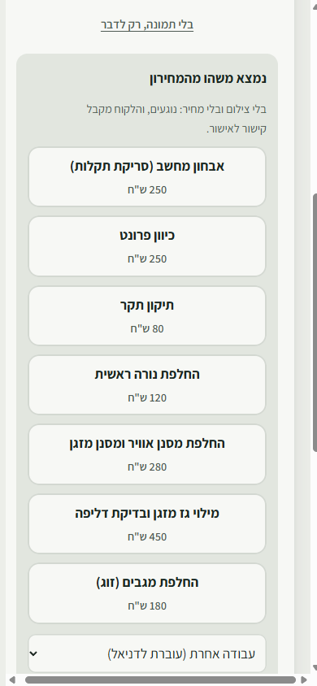

# מדריך למכונאי: העמדה שליד הליפט

> **למי:** מוטי, סאמר, אלכס, נועם, וכל מכונאי חדש.
> **כמה זמן לקרוא:** 5 דקות. **כמה זמן ללמוד:** רכב אחד.

## למה זה טוב לך

- **לא מחכים ליד רכב בלי אישור.** אם הלקוח עוד לא ענה, מורידים את הרכב לחניה ולוקחים את הבא.
- **לא מקלידים ולא מתמחרים.** מצלמים, אומרים מה ראית, ודניאל עושה את השאר.
- **תמיד ברור מה מותר לעשות ברכב.** מה שכתוב בירוק, מותר. מה שלא, לא נוגעים.

---

## 1. להיכנס

ליד כל ליפט יש טלפון או טאבלט על מתקן. הוא שייך לליפט, לא לך.

1. נוגעים **בשם שלך**.
2. מקישים **את הקוד שלך**, 6 ספרות. אין כפתור "אישור": בספרה השישית נכנסים לבד.

| | |
|---|---|
|  |  |

> **שכחת את הקוד, או שהוא ננעל** (אחרי 5 טעויות, ל-15 דקות)? דניאל קובע לך קוד חדש.

## 2. למשוך את הבא בתור

כשהליפט פנוי, רואים את **הבא בתור**. לוחצים **"למשוך לליפט"**.

> הסדר נקבע לפי מי שהגיע קודם. אם דניאל הקדים רכב, הוא יהיה ראשון.

## 3. אבחון, לפני כל עבודה

רכב חדש על הליפט: הכפתור היחיד הוא **"להתחיל אבחון"**.

לכל אחד מ-9 הפריטים בוחרים צבע:
- **ירוק (תקין):** נגיעה אחת, וממשיכים.
- **צהוב (לשים לב) או אדום (לתקן):** **"לצלם ולהגיד מה ראית"**. המצלמה נפתחת, מצלמים, ואז **ההקלטה מתחילה לבד**. אומרים במשפט אחד מה ראית, ושותקים. ההקלטה נעצרת לבד.
- **באדום ובפריט "בטיחות" חובה תמונה.**

- **טעית בצבע?** נוגעים בצבע הנכון. פריט שחוזר לירוק מבטל את מה שהוקלט עליו, כל עוד דניאל עוד לא שלח.
- **עוד תמונה לאותו פריט:** אחרי שהוא נרשם, **"להוסיף תמונה"**.
- **לא צריך לחכות להקלטה.** היא נשלחת ברקע, 20–30 שניות, ואפשר להמשיך לפריט הבא.

בסוף: **"סיום אבחון · לעבודה שאושרה"**.

> **בלי מחירים.** לא אומרים מחיר בהקלטה, וגם אם אמרת, הלקוח לא יראה אותו. המחיר מגיע מהמחירון.

## 4. מה מותר לבצע

בראש הרכב יש שורה אחת, **"עכשיו:"**, שאומרת מה עושים כרגע. למשל: "לעבוד על מה שמסומן ✓. כשמסיימים, להוריד לחניה".

מתחתיה **מה מותר לבצע**:
- **✓ ירוק:** מותר. הלקוח אישר.
- **⏳ מחכה לאישור הלקוח:** **לא לגעת** עד שמאשר.
- **📝 אצל דניאל:** עוד לא נשלח ללקוח.
- **✗ הלקוח לא אישר:** לא לבצע.

## 5. מצאת עוד משהו תוך כדי

שתי דרכים:

**א. מהמחירון** (מגבים, נורה, מסנן, תקר וכו'): **"נמצא משהו מהמחירון"** ← נוגעים בעבודה. בלי צילום. זה עובר **לדניאל**, כבר עם המחיר.

**ב. כל דבר אחר:** **"צילום ודיווח"**, מצלמים ומדברים. דניאל מקבל ומתמחר.

> **אתה לא שולח כלום ללקוח.** דניאל שולח לו **הודעה אחת** עם כל מה שנמצא ברכב, והלקוח מאשר או דוחה כל דבר בנפרד.

## 6. מחכים ללקוח? להוריד לחניה

סיימת את מה שמאושר, והלקוח עוד לא ענה? **"להוריד מהליפט לחניה"**. הליפט מתפנה לרכב הבא.

כשהלקוח יאשר, **דניאל מחזיר את הרכב לתור**, ראשון בתור. אתה או מכונאי אחר מושכים אותו שוב.

## 7. צריך את דניאל, או סיימת

- **"דניאל, בוא לעמדה":** כשצריך אותו ליד הרכב. הוא רואה את זה מיד בלוח שלו. כשהוא מגיע, הוא מאשר על המסך שלך עם הקוד שלו.
- **"סיימתי את העבודה":** דניאל בודק, ומסמן "הרכב מוכן". הלקוח מקבל הודעה. הכפתור נפתח רק כשאין ממצאים שמחכים. עד אז: להוריד לחניה.
- **שאלה מקצועית?** **"לשאול את המוסכניק הוותיק"**, בתחתית הרכב ובדף האבחון. עונה בעברית, בערבית וברוסית, ואפשר לדבר אליו.

## 8. הולך? "החלפת עובד"

למעלה בדף: **"החלפת עובד"**. אם שכחת, אחרי 15 דקות בלי נגיעה המכשיר חוזר לבד לרשימת השמות.

---

**ליד הליפט תלוי [כרטיס עמדה](station-card.md)** עם כל הצעדים האלה בעמוד אחד, בעברית, בערבית או ברוסית.

**שאלות?** דניאל הוא האיש שלך. ויש גם את [השאלות הנפוצות](faq.md).
