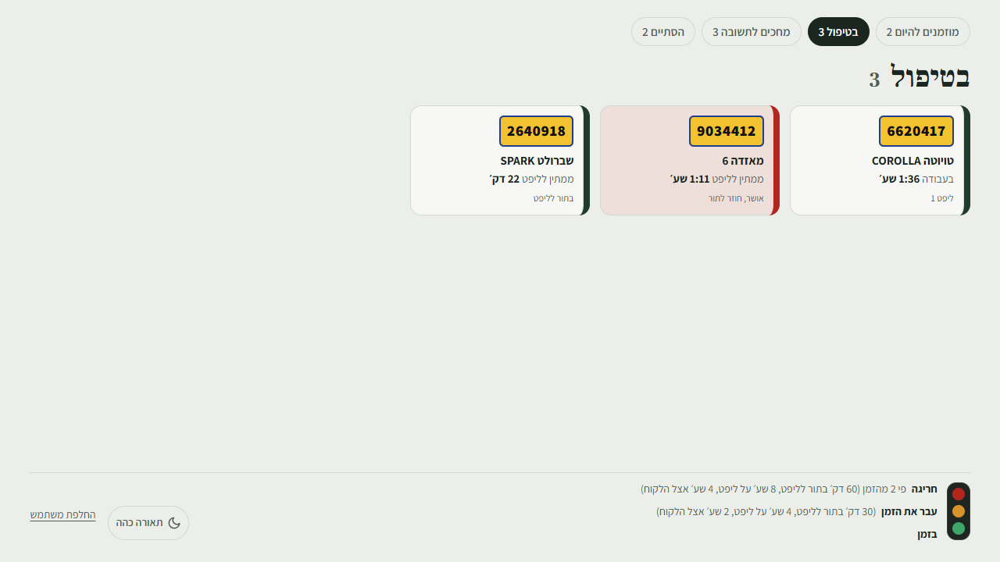
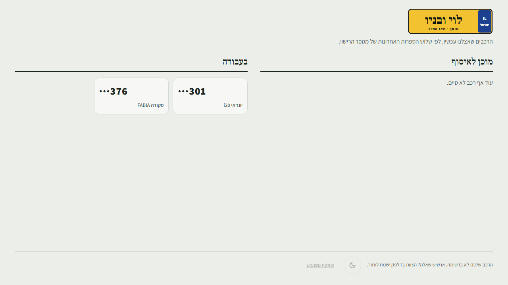

# המסכים התלויים: הסדנה וחדר ההמתנה

> **למי:** דניאל, פעם אחת בהתקנה.

## מסך הסדנה

טלוויזיה על הקיר שהמכונאים רואים מרחוק: כל רכב, איפה הוא, וכמה זמן. מתחלף בין השלבים כל 10 שניות, ומתרענן לבד.

**הצבעים (למטה):** ירוק, בזמן. כתום, עבר את הזמן (30 דקות בתור לליפט, 4 שעות על ליפט, 2 שעות אצל הלקוח). אדום, פי 2 מהזמן.

## מסך חדר ההמתנה

מה שהלקוחות שיושבים רואים: שלוש הספרות האחרונות של הלוחית, ו"בעבודה" או "מוכן לאיסוף". **בלי שמות, בלי טלפונים ובלי מחירים.**

## התקנה, פעם אחת לכל מסך

1. על המחשב או הסטיק שמחובר לטלוויזיה, פותחים דפדפן.
2. **הסדנה:** `levi-garage.co.il/wall`, נכנסים עם `screen2@test.com`.
   **חדר ההמתנה:** `levi-garage.co.il/lobby`, נכנסים עם `screen1@test.com`.
3. מסך מלא (F11), ומשאירים.

> **הסיסמה של משתמשי המסכים:** רועי מוסר אותה לדניאל ביום ההתקנה, בעל פה או בהודעה אישית. מקלידים אותה פעם אחת, והמסך נשאר מחובר. לא כותבים אותה על פתק ליד הטלוויזיה. (לבוחני הקורס: הסיסמה במסמך ההגשה, עמוד 2.)

> **למה משתמש נפרד לכל מסך:** המסך נשאר מחובר כל היום בחדר ציבורי. המשתמש שלו פותח רק את המסך שלו, ולא מגיע ללוח היום, לשמות או למחירים, גם אם מישהו ייגע במקלדת.
