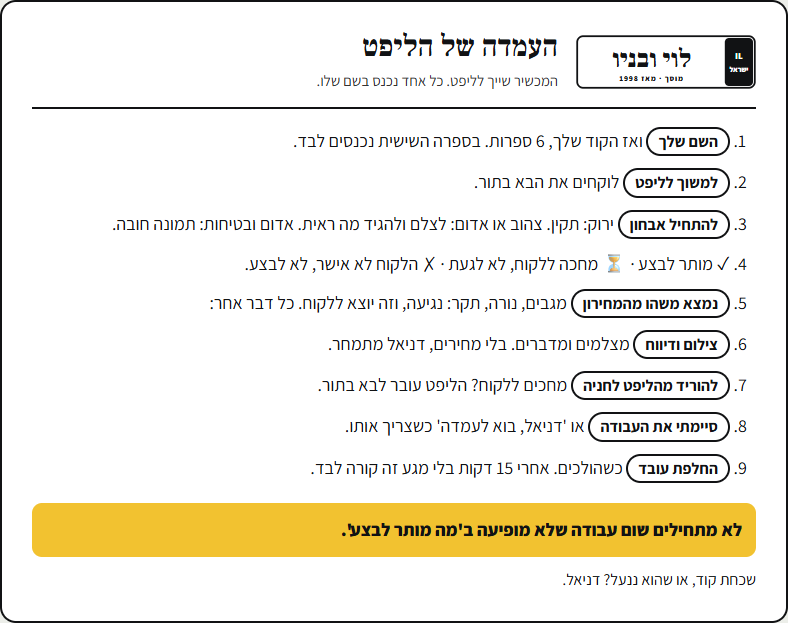
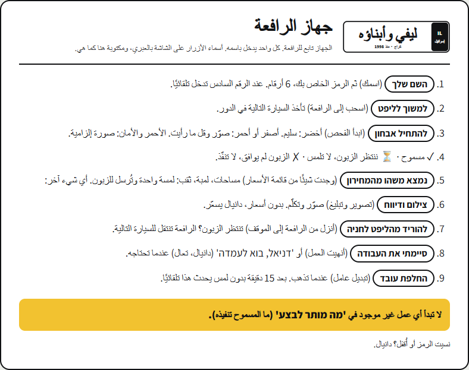
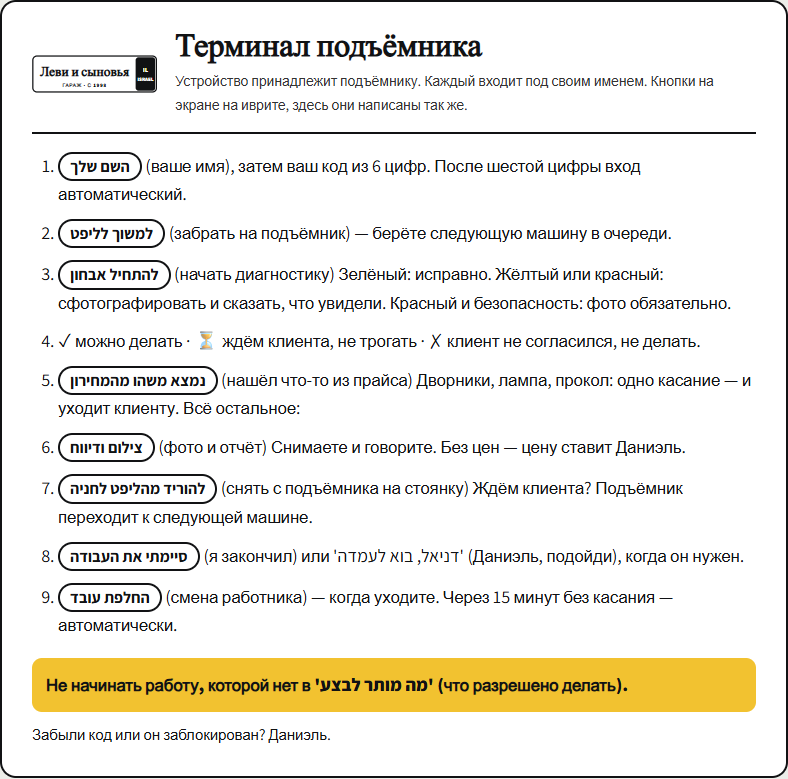

# כרטיס עמדה: עמוד אחד ליד כל ליפט

> **למי:** המכונאים, על הקיר ליד הליפט. דניאל מדפיס.
> **איפה:** בלוח הצוות, **עמדות** ← "כרטיס עמדה" ← בוחרים שפה ← **"להדפסה"**. יוצא עמוד A4 אחד.

הכפתורים במערכת כתובים בעברית. לכן גם בכרטיס בערבית וברוסית שם הכפתור מופיע **בעברית, בדיוק כמו על המסך**, ולידו תרגום בסוגריים. ככה סאמר ואלכס מחפשים על המסך את אותה מילה שרואים על הכרטיס.

בהדפסה הגופן גדל כדי שיהיה אפשר לקרוא ממטר, והכרטיס עדיין נכנס בעמוד אחד בכל שלוש השפות.

## עברית

## العربية

## Русский

